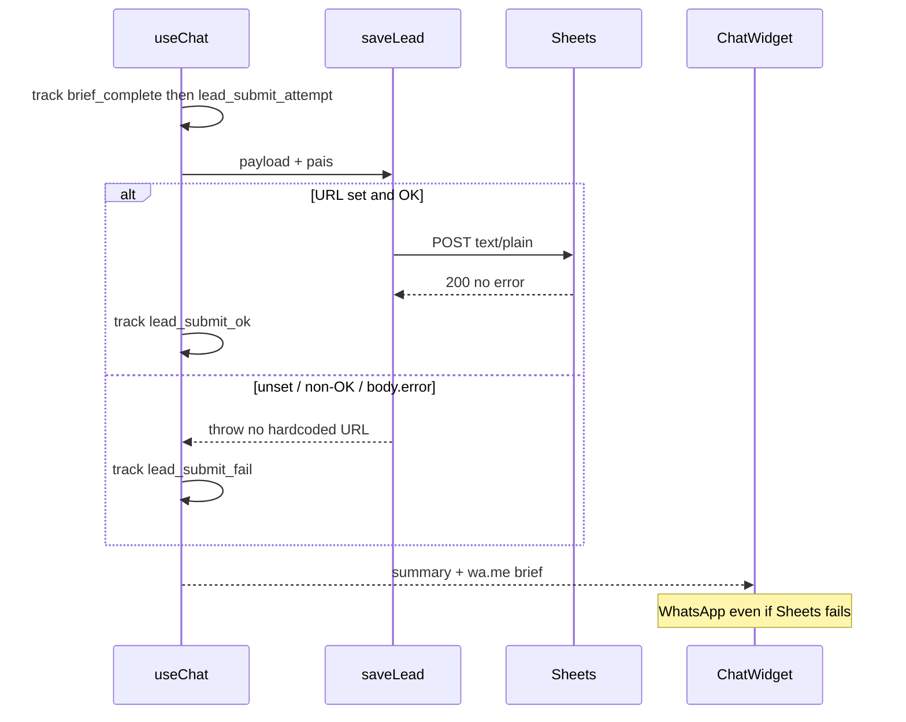

# Design: Guided Brief Questionnaire

## Technical Approach

Replace OpenRouter `useChat` with a local FSM. `ChatWidget` stays the incumbent WhatsApp world (Impeccable **Operate**: complete the brief). Landing stays Persuade. SSOT: `faq_brief_questions.ts`. Happy path never calls OpenRouter or parses `___BRIEF___`. After contact, `saveLead` (`VITE_SHEETS_URL` only) then always `compileWhatsAppLink`. Reuse `track()` (`chat_open`, `brief_complete`, `lead_submit_*`). Specs: `brief-questionnaire`, `chat-assistant`, `lead-capture`.

## Architecture Decisions

| Decision | Options | Tradeoff | Choice |
|----------|---------|----------|--------|
| FSM host | New hook vs extend `useChat` | Isolate vs reuse persist/save/track | **Extend `useChat`** |
| OpenRouter / `systemprompt.ts` | Delete vs unused | Delete blocks rollback | **Unused**. Keep `CONTACT_NAME`. No new keys. |
| Close | Confirm vs auto after `pais` | Old UI vs spec close-after-contact | **Auto `save()` after last field** |
| Empty field | Stay vs skip | Spec omitted | **Trim empty → stay** |
| Composer | Hide vs keep visible | Hide ≠ WhatsApp | **Always visible; chips stay in-thread** |
| Chips | Accent CTAs vs WA replies | Accent is a new world | **WA chips** (below) |
| FAQ trees | Inline vs SSOT file | Inline unreviewable | **`faq_brief_questions.ts`** |

## Impeccable UI (Operate, not redesign)

Preserve `--color-wa-header #008069`, `--color-wa-bg`, `--color-wa-sent`, `--color-wa-received`, `--color-wa-ink`, `--color-wa-subtle`. Keep header, bubbles, FAB, typing dots, `wa-pattern`. No testimonials. No purple/aurora chip chrome. Chip `:focus-visible` uses `wa-header`, not landing `#7c3aed`.

Pills = WhatsApp Business quick-replies: under last bot bubble, left-aligned, wrap; `rounded-full` outline/light fill (not `bg-accent`); on select, chips unmount and the label is a sent (`bg-wa-sent`) bubble; Sí/No same pattern (two only); real `<button>`s, not color-only. Consent quote: `Para poder ayudar con <intención>...`

## Data Flow

### 1. Chat FSM

```mermaid
sequenceDiagram
  participant V as Visitor
  participant W as ChatWidget
  participant H as useChat
  participant F as faq_brief_questions
  V->>W: open FAB or CHAT_OPEN_EVENT
  W->>H: start()
  H->>H: track chat_open
  H-->>W: local greet + 7 chips
  V->>H: selectChip
  Note over H: no back; projectType = intention
  H-->>W: consent + Si/No chips
  alt Si
    loop FAQ
      H->>F: next(id, step)
      F-->>H: prompt, mapsTo
      V->>H: send(text)
      H->>H: BriefData[mapsTo]
    end
  else No
    V->>H: idea free-text
  end
  loop nombre empresa email whatsapp pais
    V->>H: send empty trim stays
  end
  H->>H: compile + save
```

### 2. Lead persist + WhatsApp



`Contacto.tsx` still calls `saveLead` (no `pais`). No GTM change.

## File Changes

| File | Action | Description |
|------|--------|-------------|
| `src/hooks/useChat.ts` | Modify | FSM, `selectChip`, `pais` on `BriefData`, auto-save, WhatsApp includes `pais`; skip OpenRouter/`extractBrief` |
| `src/components/ChatWidget.tsx` | Modify | WA chips in-thread; composer always visible; summary `pais` |
| `src/lib/faq_brief_questions.ts` | Create | 7 intentions, steps, `next`, mapsTo |
| `src/lib/saveLead.ts` | Modify | Forward `pais` if present; env-only URL |
| `src/lib/systemprompt.ts` | Unused | Keep for `CONTACT_NAME`. Do not delete. |
| `src/lib/chat-events.ts` | Unchanged | Open event |
| `src/index.css` | Unchanged | Reuse `wa-*` tokens |
| `src/components/Contacto.tsx` | Unchanged | |

Bump persist key to `rst_chat_state_v3`: `{messages, brief, step, intentionId, briefClosed}`.

## Interfaces / Contracts

```ts
type IntentionId =
  | "erp" | "pos" | "ecommerce" | "gestion-pasteleria"
  | "fintech-prestamos" | "fintech-inversiones" | "fintech-seguros";

type FaqMapsTo = Extract<keyof BriefData,
  "idea"|"target"|"problem"|"detailValue"|"complejidad"|"timeline"|"urgencia"|"presupuesto"|"modalidad">;

type FaqStep = { id: string; prompt: string; mapsTo: FaqMapsTo; detailLabel?: string };
type IntentionFaq = { id: IntentionId; projectType: string; pillLabel: string; steps: FaqStep[] };

getIntention(id): IntentionFaq
nextFaqStep(id, currentStepId: string | null): FaqStep | null  // null → contact
PILL_LABELS: readonly string[]  // length 7; no "Otro"
```

`projectType`: `ERP`, `POS`, `E-commerce`, `Gestión pastelería/tienda`, `Fintech - préstamos`, `Fintech - inversiones`, `Fintech - seguros`.

`useChat` adds `step`, `chips: string[] | null`, `selectChip(label)`. `send()` only on FAQ/idea/contact.

## Testing Strategy

| Layer | What to Test | Approach |
|-------|--------------|----------|
| Typecheck / build | FSM types | `bun run lint`, `bun run build` |
| Unit / integration / E2E | — | No runner; no harness |
| Manual UI | Open, 7 pills, consent, FAQ, idea, contact, Sheets fail | Checklist |

Manual: open without OpenRouter key; 7 pills no Otro; chips unmount + sent bubble; Sí/No; FAQ `mapsTo`; No → idea; five contact fields (empty stays); Sheets fail still WhatsApp; Contacto unchanged; reset = new session.

## Migration / Rollout

None. Old `rst_chat_state_v2` ignored. Rollback: restore OpenRouter `useChat` + widget; keep env-only secrets. `pais` additive.

## Open Questions

- [x] Empty-field validation (spec omitted): **trim empty → stay on step**.
